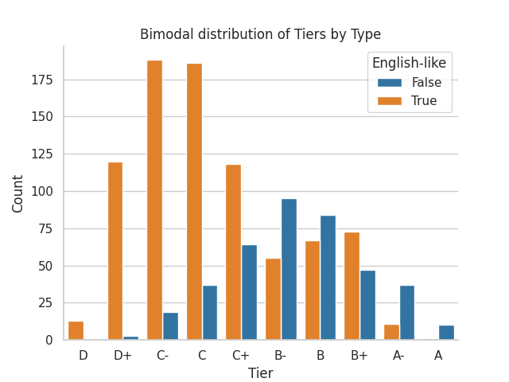
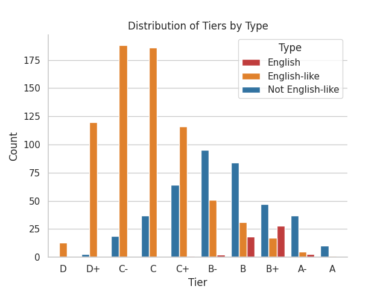
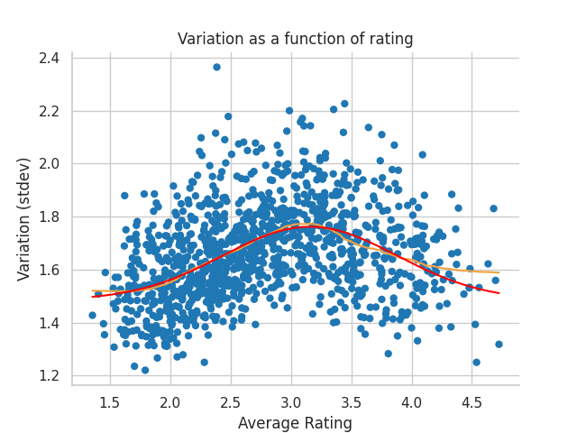

# Favorite Latin Letters Survey
Analysis and visualization of letters as rated by tumblr users

# Summary

1179 letters were included in a survery and rated from 0 to 6. These were broken down into letter tiers similar to those in schools, (F,D,C,B,A,S). The heighest and lowest teirs were not populated, as the average scores naturally fell between 1 and 5. Though this distribution appears largely mono-modal, we can demonstrate there are at least 3 intuitive groupings we can aplit this dataset into and show it is the combination of 3 close to normal distributions.

English letters scored high in rating, and low in variation. As a whole, they are statistically different than less common latin letters (this is an english survey on an english social media platform). As is intuitive, there is one outlier in english letters in average as well as standard deviation.

The outlier with a low average is l (lowercase L). 

The most polarizing letter with a outlier high variation is O (capital o).

This may be because of the familiarity with the letters. The font used was Arial, an extremely common font, so uncommon forms of letters were not present. Some fonts use less common, alternate glyphs for letters like a or g that could have influenced the ratings.

This can be demonstrated after data mining. While the 52 english letters score high, english-like letters comprise the vast bulk of our low scoring data. 

In blue, letters, like many greek letters, provide the high variation and high scoring bridge between our highly scoring english alphabet and low scoring english-like symbols.

This can be very clearly seen in breaking down the initial tier histogram, that the english-like characters is a bimodal distribution.

Splitting these distributions further into the 52 english letters, english-like letters, and english-unlike letters we can clearly see there are at least 3 distributions present. There is poential that the english-like letters could be broken down further, such as into capital and lowercase letters, and more distributions would be apparent, but that starts to split the dataset quite finely and noise may start to become a factor.

## Restrictions on analysis

We can not know if this is influenced by font. This survery was conduction on google forms deafult font, Arial.

This was further seen in some very low total vote letters, which showed as error glyphs in many fonts (but not in the survery). eg unicode U+1DF26 Latin small letter L with mid-height left hook.

Assumption: Many of these characters would be unfamiliar to readers, and therefore this survery is mostly an indicator of initial attraction of a shape, excepting the egnlish alphabet.

# Analysis
### Purpose
To analyze the favorability and distributions of latin letters in a favorabiilty poll.

## EDA overview

Higher average ratings gathered more votes total, indicating people had stronger opinions and were more likely to rate more attractive characters.

Returning to the histogram of average ratings, we can see little difference in the mean and median indicating low skew in the average ratings. However, we see high kurtosis, indicating there is a sharp drop between score with high counts and scores with low counts.

 

In comparison, there is almost no skew in the number of votes per letter, indicating a close to normal distribution in total vote counts. Interestingly, the kurtosis value is 1 (< 3, platykurtic), indicating it is a flatter distribution than normal. This goes against my initial intuition viewing this plot, but I can see the justification for this feature.

Digging deeper into various distributions of obvious subgroups, this plot shows us there are many outliers in vote counts for extreme low (0) , high (6), and ambivalent (3) scores. I know this is a feature of human survery behavior, the highest, lowest, and most middle options are the most voted, as it is more complex to vote intermediate favorabilities. However, this plot gives us good information, the middle counts had, on average, more votes than the upper and lower extremes. This provides some confidence that most values were voted on.

## Statistics and modelling

Here we provide a plot of rating variation (stdev) versus average rating. We will return to this plot frequently later. In red we have a model of the data provided by:  $a * e^{\frac{-(x - b)^2}{2 * c^2}} + d$. The savgol filtered data and the normal distribution model match very well in the lower range of data, but diverges in variability for the in the higher average data points. This continues to suggest that there is a bias towards voting for the high favorability data, with extremely positive votes skewing the variability in high scores.

A quick T-test was done to confirm that the high variability center is different than the low variability edges of the dataset. The side regions were tested against the center region, and shown to be statistically distinguishable, as expected viewing the uncolored plot. This region comprises of the middle third of datapoints by count, after ordered according to the savgol filter.

## English letters vs other letters

Continuing with this same average rating vs variation plot with a double savgol filter to estimate a midline to the density, we can see that regular english letters score high in rating, with low variabilities, some some exceptions.

The outlier with a low average is l (lowercase L). 

The most polarizing letter with a outlier high variation is O (capital o).

## Conclusions

If we look at the strict 52 english letters we see the same story as shown above. The english letters are a small high average rating enclave within the much broader set of all letters. For this plot the two KDE plots were done seperately, meaning the orange english letters do not contribute to the blue KDE plot.

However, this whole storyline gets muddied when plotting english-like letters. Regular english characters are highly rated, but there is a significant subset of latin letters that are english letters with accents. This KDE-scatter plot collects all the english-like letters, from the common english alphabet to those with small deviations, like accents.

This plot tells us that while the 52 english letters score high, english-like letters comprise the vast bulk of our low scoring data. 

The blue, english-unlike letters, like many greek letters, provide the high variation and high scoring bridge between our highly scoring english alphabet and low scoring english-like symbols.

Exmanding on this thought, we can clearly see a bimodal distribution of english-like vs english unlikem characters.

Breaking it down a tiny bit further, we can see the long flat tail for the english-like characters comes from the 52 english alphabet characters that rank high and statistically distinct from the english-like characters, and are an example of familiarity bias introduced in a simple survery.

Highest Tier letters for their respective categories.
The english characters in A- are: X, e, W.
The english-like characters in A- are:  ø,  Ö,  Ø,  ɀ,  ü.
The english-unlike characters in A are: ʘ, ɤ, ᴥ, Þ, ɸ, ß, Ʃ, ʃ, ꝝ, ʔ.

## Survey and data links

https://docs.google.com/forms/d/e/1FAIpQLSeP3hnCQVRuIeGSHt6z1kGu3G5AF_SzOy38KQ5DjljhW4XM8w/viewform

Imspiration for this analysis

https://oqmemphis.tumblr.com/post/774305906449104896/okay-im-aware-that-misali-probably-is-intending

## Survey Methodology
>letter popularity poll
what are YOUR favorite Latin letters? rate as many of these letters as you want on a scale from 0 to 6, where your least favorite letters are 0 and your favorite letters are 6.
>
>  do not feel obligated to provide a rating for every single letter. the order is randomized and all questions are optional, so it's completely fine to only partially fill out the form.
>
>  only characters included in Unicode 16.0 as Latin letters are listed here. "modifier letters" and certain compatibility characters are not counted.
